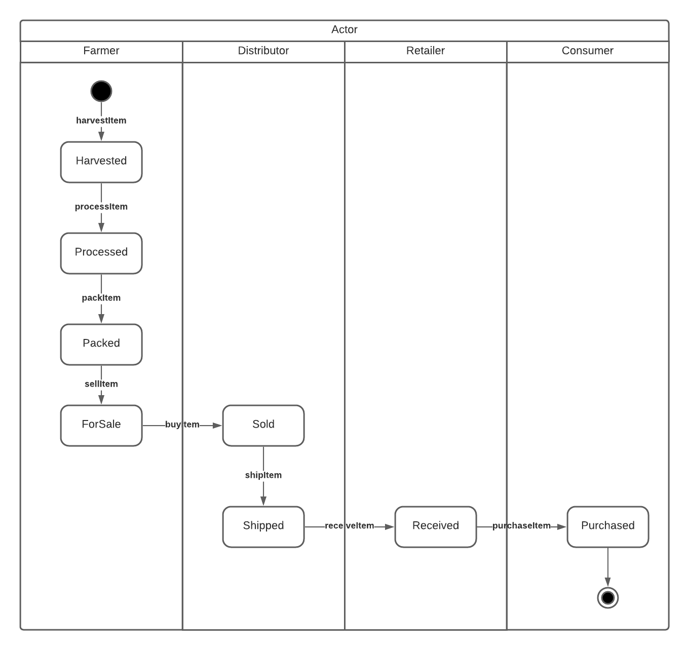

# Udacity Supply Chain DAPP

## Smart Contract Design

### Activity Diagram
The below activity diagram shows the key activities in our imaginary supply chain, and the actors that perform them.


### Sequence Diagram
The below sequence diagram shows the interaction between actors in our workflow.


### State Diagram
The below state diagram shows the state transitions and actions that trigger them, in our work flow. Lanes are used to reflect the authorised role for performing an action. 



### Class Diagram
The below class diagram shows the base contracts (Roles and Ownable), along with the main contract SupplyChain, and it's structure Item, for storing product state.


### Client Code

The client code is designed to closely reflect workflow operations for a given role. 
It supports: 
- The ability to add roles to a wallet, by entering a wallet address, and clicking the required 'Add {ROLE}' button
- The ability to record a new harvested product, by entering farm and product details and clicking the 'Harvest' button
- The ability to fetch and display a product, by entering a UPC and clicking the 'Fetch Data' button
- The ability to transition a product through each of the workflow stages, by entering a UPC, any additional info (eg: 'Product Price' for putting an item in the ForSale state), and clicking the appropriate action button
- Results of workflow transitions are displayed in a simple list at the bottom of the page

## Tooling and Libraries

To build locally requires the following: 
- Truffle v5.3.0 
- Node v14.13.0
- Solidity v0.8.0

The code has the following library dependencies: 
- web3 v1.2.4 - for connection to the Ethereum network and interaction with the Solidity Smart Contract
- truffle-assertions v0.9.2 - for asserting events have been fired on the Solidity Smart Contract 
- webpack v4.41.2 - as a lightweight development webserver

IPFS has not been used to deploy this project. 

## Code
- The smart contract code is located in `project-6\contracts\`
  - coffeeaccesscontrol - contains the base role and actor role definitions (Farmer, Distributor, Retailer, Consumer)
  - coffeecore - contains the Ownable contract definition, for checking and transfering contract ownership
  - coffeebase - contains the SupplyChain contract, holds workflow functions
- The smart contract test code is located in `project-6\test\`
- The migration code is located in `project-6\migrations\`
- The web front end code is located in `project-6\src\`

## Rinkeby Deployment
Deployed contract details on the Rinkeby network: 
- Contract address: 0xAd0ba40f57cf0a1A5fd32F5947390337B56F13bE
- Deployment Transaction: 0xdef031f72af0b838fed356ee929d70621cd5eca0c3432164d493afecaa9c5768
- Deployment Account: 0x59fc18792978cd78F75379a993AA5b8AC7c00031

## Building the SmartContract
- Change to the `project-6` directory
- Adjust the 'networks - develop' section of truffle-config.js to suite your dev environment (the default is set to hostname 0.0.0.0 on port 8545, to support building on wsl2 running on Windows 10)
- Launch the local ethereum test network by running `truffle develop`
- To build, execute `compile`
- To deploy, execute `migrate --reset`
- To test, execute `test` 

## Building the web application 
- Change to the `project-6` directory
- Run `npm install`
- Run `npm run dev`
- Browse to `http://localhost:8080`, log in to Metamask, and connect to the local ethereum block chain

## Deploying to Rinkeby (or other test network) using Infura 
- Install the hardware wallet provider: `npm install @truffle/hdwallet-provider`
- Configure the network in truffle-config.js, including an infura project id and mnemonic (held in .secrets and not included in the repo)
- Launch the console, connected to the test network: `npx truffle console --network rinkeby`
- Check that you have an account with funding: 
  - List accounts: `await web3.eth.getAccounts()`
  - Check balance: `await web3.eth.getBalance('0x000MYACCOUNTID000')`
- Deploy: `migrate`


## Reference

### Truffle Develop output: 
```
phil@DESKTOP-7RDQCFQ:~/projects/udacity/ethereum/UdacitySupplyChainDapp/project-6$ truffle develop
Truffle Develop started at http://0.0.0.0:8545/

Accounts:
(0) 0x97a52a92609895d08e45098ad39ed28aadf02afe
(1) 0x2c4605e73e21616020b56ca1a71f49772a3761c4
(2) 0xb0ced4896f802c9e86c68eafc33c9dc9f9e99771
(3) 0xc54515509a237f72a6c5e8e484218bb315b65c33
(4) 0xa020cf12da7662da7e8fc1eb4e20254979be99ca
(5) 0x0362da34b3b1ab1bbfd4f773b1d99d3799cceff8
(6) 0x73d99758af60e078d937845ec71d2efd5fe01ad3
(7) 0xfa7d4b3a25e6da14b715cc2183cdbdf6d26e3eea
(8) 0xb7db75acb37407f5494581b9ab124103f8b1cf45
(9) 0x27bef26d37b22a813aa677db8c4ddb0d07705cf0

Private Keys:
(0) 26b208601f094ea787873dab07be8a148e8648214b813a546ef863eeefa720a9
(1) 5758ae9fdd1cff8d3154ee43997d6f6a852fb282e551e1f953cbc51e2a1f234a
(2) b0641cedec2194f0e0512c7796823c2862edae1461c632b34bd17d096453676e
(3) 269ecc3bf3c894a00ec78647626b0698bc507385f32eea8915afcd24e7c95917
(4) 59589c069a4796634de7f60b2e103a118d32a75e36efd6914139aa8e33835ab5
(5) 51ec1e744a0b98dbbbc6ef47dd163ceb954dee84a5c060aa67a89e7198d6ddb8
(6) 41233043d11cc087cfe4f70b36ce3476e02290dea2acc0273c4d8c61eecc1772
(7) a287516a9dcdfda0522eb73fcafa66be2126d82a65ecbd2b5babc7d463cacc26
(8) 0ac80d913e52382266071e854cc1c01c9b38af53e7ca16e67ea3d31c0e2b241c
(9) b5cf185016b6abaf00e03e895d21bd2a59f9558388a0b7f576a51f0f1bbd175d

Mnemonic: month atom oxygen derive test wheat dance relief today public combine caution

⚠️  Important ⚠️  : This mnemonic was created for you by Truffle. It is not secure.
Ensure you do not use it on production blockchains, or else you risk losing funds.

truffle(develop)>
```

### Deployment output: 
```
truffle(rinkeby)> migrate

Compiling your contracts...
===========================
> Everything is up to date, there is nothing to compile.


Starting migrations...
======================
> Network name:    'rinkeby'
> Network id:      4
> Block gas limit: 10000000 (0x989680)


1_initial_migration.js
======================

   Deploying 'Migrations'
   ----------------------
   > transaction hash:    0xdcf9a6706ecb8cf4fb21ecf5083f03d2b0c7e97a57a01f53bbd7636d224fd64a
   > Blocks: 2            Seconds: 17
   > contract address:    0x44d84CB0F3bbF1cde4CEafdbe937C71124865A18
   > block number:        8643835
   > block timestamp:     1621893191
   > account:             0x59fc18792978cd78F75379a993AA5b8AC7c00031
   > balance:             5.994242921
   > gas used:            271700 (0x42554)
   > gas price:           20 gwei
   > value sent:          0 ETH
   > total cost:          0.005434 ETH

   Pausing for 2 confirmations...
   ------------------------------
   > confirmation number: 1 (block: 8643836)
   > confirmation number: 2 (block: 8643837)

   > Saving migration to chain.
   > Saving artifacts
   -------------------------------------
   > Total cost:            0.005434 ETH


2_deploy_contracts.js
=====================

   Deploying 'FarmerRole'
   ----------------------
   > transaction hash:    0x9619b561ad39fa694b2e87e3686c8d1b3ae06fd54e4d0672f2a948e9c29812b0
   > Blocks: 1            Seconds: 9
   > contract address:    0x921A26F1a4054F186351F95542eB0eaeA762Ea41
   > block number:        8643839
   > block timestamp:     1621893251
   > account:             0x59fc18792978cd78F75379a993AA5b8AC7c00031
   > balance:             5.986736521
   > gas used:            329382 (0x506a6)
   > gas price:           20 gwei
   > value sent:          0 ETH
   > total cost:          0.00658764 ETH

   Pausing for 2 confirmations...
   ------------------------------
   > confirmation number: 1 (block: 8643840)
   > confirmation number: 2 (block: 8643841)

   Deploying 'DistributorRole'
   ---------------------------
   > transaction hash:    0xbe347b745d56e1ad68919e17517577a18c4e7d61fac004a6e0cc69e92eb7c518
   > Blocks: 2            Seconds: 25
   > contract address:    0xbc06f47d6552895d0B60dcd5D16F7d711B0368Cb
   > block number:        8643843
   > block timestamp:     1621893311
   > account:             0x59fc18792978cd78F75379a993AA5b8AC7c00031
   > balance:             5.980148881
   > gas used:            329382 (0x506a6)
   > gas price:           20 gwei
   > value sent:          0 ETH
   > total cost:          0.00658764 ETH

   Pausing for 2 confirmations...
   ------------------------------
   > confirmation number: 1 (block: 8643844)
   > confirmation number: 2 (block: 8643845)

   Deploying 'RetailerRole'
   ------------------------
   > transaction hash:    0x678a87b2da4dd39442e66f14b3fc4cd9601af0706035a7f04fb58351bf6bfb06
   > Blocks: 1            Seconds: 9
   > contract address:    0xF92dEA8d6Ce008761D22472964F925c467988085
   > block number:        8643846
   > block timestamp:     1621893356
   > account:             0x59fc18792978cd78F75379a993AA5b8AC7c00031
   > balance:             5.973561241
   > gas used:            329382 (0x506a6)
   > gas price:           20 gwei
   > value sent:          0 ETH
   > total cost:          0.00658764 ETH

   Pausing for 2 confirmations...
   ------------------------------
   > confirmation number: 1 (block: 8643847)
   > confirmation number: 2 (block: 8643848)

   Deploying 'ConsumerRole'
   ------------------------
   > transaction hash:    0x67e3c592e11975fb81fb406cc72fc8efa6b22e3673f26db309940b0c270de88f
   > Blocks: 2            Seconds: 25
   > contract address:    0x1E11C46F991275c31c2E50607D77E22Cf20D382F
   > block number:        8643850
   > block timestamp:     1621893416
   > account:             0x59fc18792978cd78F75379a993AA5b8AC7c00031
   > balance:             5.967711021
   > gas used:            292511 (0x4769f)
   > gas price:           20 gwei
   > value sent:          0 ETH
   > total cost:          0.00585022 ETH

   Pausing for 2 confirmations...
   ------------------------------
   > confirmation number: 1 (block: 8643851)
   > confirmation number: 2 (block: 8643852)

   Deploying 'Ownable'
   -------------------
   > transaction hash:    0x04a84d46db9f112d3edf79b0c38205547691e13080a54896fba0b704a60b4361
   > Blocks: 1            Seconds: 9
   > contract address:    0xccaD50bc11bbaa6C9B7FD1a535515B0a7eb07bAF
   > block number:        8643853
   > block timestamp:     1621893461
   > account:             0x59fc18792978cd78F75379a993AA5b8AC7c00031
   > balance:             5.961061201
   > gas used:            332491 (0x512cb)
   > gas price:           20 gwei
   > value sent:          0 ETH
   > total cost:          0.00664982 ETH

   Pausing for 2 confirmations...
   ------------------------------
   > confirmation number: 1 (block: 8643854)
   > confirmation number: 2 (block: 8643855)

   Deploying 'SupplyChain'
   -----------------------
   > transaction hash:    0xdef031f72af0b838fed356ee929d70621cd5eca0c3432164d493afecaa9c5768
   > Blocks: 1            Seconds: 9
   > contract address:    0xAd0ba40f57cf0a1A5fd32F5947390337B56F13bE
   > block number:        8643856
   > block timestamp:     1621893506
   > account:             0x59fc18792978cd78F75379a993AA5b8AC7c00031
   > balance:             5.904785321
   > gas used:            2813794 (0x2aef62)
   > gas price:           20 gwei
   > value sent:          0 ETH
   > total cost:          0.05627588 ETH

   Pausing for 2 confirmations...
   ------------------------------
   > confirmation number: 1 (block: 8643857)
   > confirmation number: 2 (block: 8643858)

   > Saving migration to chain.
   > Saving artifacts
   -------------------------------------
   > Total cost:          0.08853884 ETH


Summary
=======
> Total deployments:   7
> Final cost:          0.09397284 ETH


- Fetching solc version list from solc-bin. Attempt #1
- Blocks: 0            Seconds: 0
- Saving migration to chain.
- Blocks: 0            Seconds: 0
- Blocks: 0            Seconds: 0
- Blocks: 0            Seconds: 0
- Blocks: 0            Seconds: 0
- Blocks: 0            Seconds: 0
- Blocks: 0            Seconds: 0
- Saving migration to chain.
```